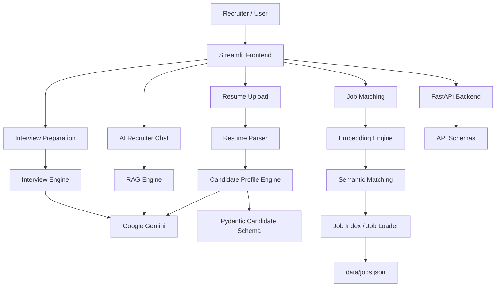

# 🤖 AI Recruitment Assistant

An AI-powered recruitment assistant built with **Python, Streamlit, FastAPI, Google Gemini, embeddings, semantic search, and Pydantic**.

The application helps recruiters analyze candidate resumes, identify suitable job matches, understand skill gaps, prepare interview questions, and interact with an AI recruiter assistant.

## 🚀 Live Demo

- **Frontend:** https://recruiter-ai-assistant-1.onrender.com
- **Backend API:** https://recruiter-ai-assistant.onrender.com
- **API Documentation:** https://recruiter-ai-assistant.onrender.com/docs

> The application is deployed on Render. The free web-service tier may spin down after inactivity, so the first request can take longer while the service starts.

---

## ✨ Features

### 📄 Resume Analysis
- Upload a PDF resume.
- Extract resume text.
- Generate a structured candidate profile using Google Gemini.
- Extract candidate name, skills, professional experience, roles, and education.
- Uses structured Pydantic schemas for reliable AI output.

### 🎯 Job Matching
- Compare candidate profiles against available jobs.
- Generate a match score.
- Identify matching skills.
- Identify missing skills.
- Provide match details to help recruiters evaluate suitability.

### 🔎 Semantic Job Search
- Uses embeddings and semantic similarity to find relevant opportunities.
- Supports job indexing and matching through the project's embedding and job-index modules.

### 💬 AI Recruiter Assistant
Recruiters can ask questions about the candidate and available opportunities, including:
- Suitable job roles
- Candidate strengths and gaps
- Job suitability
- Location and experience requirements
- Interview preparation
- Recruitment-related recommendations

### 🎤 Interview Preparation
- Select a job for interview preparation.
- Generate personalized interview questions based on the candidate profile and selected job.
- Questions are generated for the candidate/job context rather than being generic questions.

### ⚙️ Backend API
The project also exposes a FastAPI backend for core recruitment functionality.

Available API areas include:
- Health checking
- Resume upload
- Structured API schemas
- Backend processing for recruitment workflows

Interactive API documentation is available through FastAPI Swagger UI at `/docs`.

---

## 🧠 Architecture



---

## 🛠️ Tech Stack

| Category | Technology |
|---|---|
| Language | Python 3.11 |
| Frontend | Streamlit |
| Backend | FastAPI |
| AI / LLM | Google Gemini |
| Validation | Pydantic |
| Embeddings | Google Gemini / embedding workflow |
| Semantic Search | FAISS |
| Resume Processing | PyMuPDF |
| Data | JSON |
| Environment Management | python-dotenv |
| Deployment | Render |
| Version Control | Git / GitHub |

---

## 📁 Project Structure

```text
recruiter-ai-assistant/
│
├── api/
│   ├── __init__.py
│   ├── main.py
│   └── schemas.py
│
├── data/
│   └── jobs.json
│
├── src/
│   ├── __init__.py
│   ├── candidate_matcher.py
│   ├── candidate_schema.py
│   ├── candidate_summary_engine.py
│   ├── candidate_summary_schema.py
│   ├── embedding_engine.py
│   ├── intake_schema.py
│   ├── interview_engine.py
│   ├── interview_schema.py
│   ├── job_index.py
│   ├── job_loader.py
│   ├── job_matcher.py
│   ├── job_schema.py
│   ├── llm.py
│   ├── matching_engine.py
│   ├── profile_engine.py
│   ├── profile_schema.py
│   ├── rag_engine.py
│   ├── resume_parser.py
│   ├── screening_engine.py
│   └── screening_schema.py
│
├── app.py
├── config.py
├── requirements.txt
├── .python-version
├── .gitignore
├── README.md
│
├── test_candidate_embedding.py
├── test_candidate_summary.py
├── test_embedding.py
├── test_interview.py
├── test_job_index.py
├── test_jobs.py
├── test_llm.py
├── test_matching.py
├── test_profile_engine.py
├── test_rag.py
└── test_screening.py
```

---

## 🔄 Application Flow

```text
Resume PDF
    ↓
Resume Parser
    ↓
Candidate Profile Extraction
    ↓
Google Gemini
    ↓
Structured Candidate Profile
    ↓
Candidate ↔ Job Matching
    ↓
Embeddings / Semantic Search
    ↓
Match Score + Matching Skills + Missing Skills
    ↓
Recruiter Assistant / Interview Preparation
```

---

## 🔐 Environment Variables

Create a local `.env` file for development.

Example:

```env
API_KEY=your_google_gemini_api_key
MODEL_NAME=your_configured_gemini_model
TEMPERATURE=0
MAX_TOKENS=1000
```

Do **not** commit `.env` or API keys to GitHub.

The deployed Render service should receive these values through Render's **Environment Variables** configuration.

---

## 💻 Local Setup

### 1. Clone the repository

```bash
git clone https://github.com/jacobabhihail-tech/recruiter-ai-assistant.git
cd recruiter-ai-assistant
```

### 2. Create a virtual environment

```bash
python -m venv venv
```

Activate it on Windows:

```powershell
venv\Scripts\Activate.ps1
```

### 3. Install dependencies

```bash
pip install -r requirements.txt
```

### 4. Configure environment variables

Create `.env` in the project root:

```env
API_KEY=your_google_gemini_api_key
MODEL_NAME=your_configured_gemini_model
TEMPERATURE=0
MAX_TOKENS=1000
```

### 5. Run the Streamlit application

```bash
streamlit run app.py
```

The Streamlit application will open locally in your browser.

---

## 🔌 Run the FastAPI Backend

From the project root:

```bash
uvicorn api.main:app --host 0.0.0.0 --port 8000
```

Then open:

```text
http://localhost:8000/docs
```

to access the interactive Swagger API documentation.

---

## 🧪 Testing

The repository includes separate test files covering major components such as:

- Candidate embeddings
- Candidate summaries
- Embeddings
- Interview generation
- Job indexing
- Job loading
- LLM integration
- Matching
- Profile engine
- RAG
- Screening

Run the test suite with:

```bash
pytest
```

---

## ☁️ Deployment

The project is deployed using **Render**.

The deployment setup separates the user-facing Streamlit application from the FastAPI backend.

### Frontend

```text
Streamlit → Render
```

### Backend

```text
FastAPI + Uvicorn → Render
```

Environment-specific secrets such as the Gemini API key are configured through Render environment variables rather than stored in the repository.

---

## 🎯 What This Project Demonstrates

This project demonstrates practical implementation of:

- LLM-powered application development
- Structured LLM output
- Resume parsing
- Candidate profiling
- Semantic job matching
- Embeddings
- Vector search
- RAG-based recruitment assistance
- AI-generated interview preparation
- Pydantic data validation
- FastAPI backend development
- Streamlit application development
- Environment-based configuration
- Automated testing
- Git/GitHub workflow
- Cloud deployment with Render

---

## 📌 Project Status

**Completed and deployed.**

The project was built as a practical GenAI engineering project focused on applying LLMs, embeddings, semantic search, structured outputs, APIs, and deployment to a real-world recruitment workflow.

---

## 👨‍💻 Author

**Abhihail Jacob**

Python | Machine Learning | Generative AI | LLMs | RAG | FastAPI | Streamlit

GitHub: https://github.com/jacobabhihail-tech
